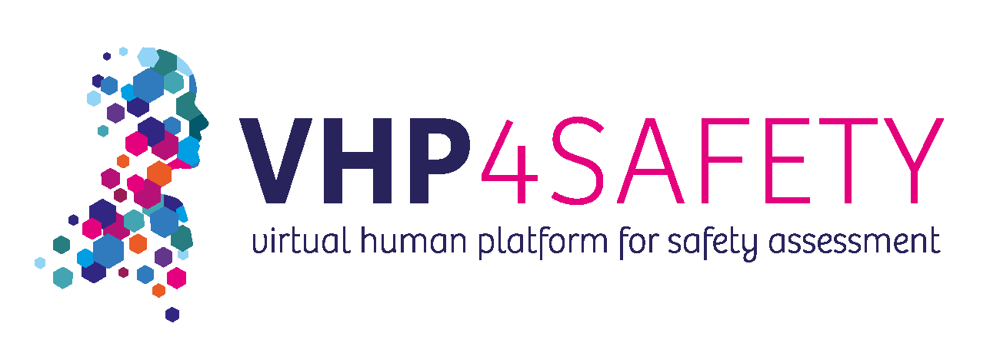

# Querying the AOP-Wiki using the REST API

[Back to overview](README.md)

## Introduction
Welcome to the AOP-Wiki API workshop section. This tutorial is designed to introduce you to the basics of querying the AOP-Wiki database using the RESTful API provided through the Swagger UI. The AOP-Wiki API also allows you to programmatically access and retrieve data related to Adverse Outcome Pathways (AOPs). As the API is still under active development, the exercises presented here are fundamental and intended to familiarize you with the core functionalities.

## AOP-Wiki general description
The AOP-Wiki serves as the primary repository of qualitative information for AOPs and is a central component in the AOP development effort coordinated by the Organisation for Economic Co-operation and Development (OECD). These AOPs describe mechanistic information about toxicodynamic processes and can be used to develop effective risk assessment strategies. An AOP is initiated by a stressor (e.g. a chemical) that causes a Molecular Initiating Event, which is followed by Key Eevents (measurable, essential steps) along a pathway towards an Adverse Outcome for an organism or population. KEs are connected through Key Event Relationships (KERs), which capture the evidence supporting the AOP in a structured way. 

## The AOP-Wiki Swagger UI and API
The Swagger UI can be found at [aopwiki-api.cloud.vhp4safety.nl/api/marvinm2/AOPWikiQueries](https://aopwiki-api.cloud.vhp4safety.nl/api/marvinm2/AOPWikiQueries). Please be aware that te page requires some time to load.

## Exercises
Go to https://aopwiki-api.cloud.vhp4safety.nl/api/marvinm2/AOPWikiQueries

These exercises can also be done through coding environments such as R or Python. Please have a look at the service documentation for more information about this: [add link].

### Testing Functions
Go to the request called `get-all-mies` and run it.

Question 1.1: What is the ID for the MIE "Activation, LXR"?

<button onclick="toggleAnswer('q1.1')">Answer</button>167

Go to the request called `get-ao-for-mie` and run it with the ID that you found in the previous exercise.

Question 1.2: Which AO is linked to this MIE?

<button onclick="toggleAnswer('q1.2')">Answer</button>Liver steatosis, with KE IDs 345 and 459.

Go to the `get-mie-for-ao` call.

Question 1.3: How many unique MIEs lead to the AOs found in the previous exercise?

<button onclick="toggleAnswer('q1.3')">Answer</button>16

### Using CURL

Question 2: What needs to change in the CURL command to save the file as "aops.csv"?

<button onclick="toggleAnswer('q2')">Answer</button>You need to add the `-o aops.csv` option at the end of the CURL command:
curl -X GET "https://aopwiki-api.cloud.vhp4safety.nl/api-git/marvinm2/AOPWikiQueries/get-all-chemicals" -H "accept: text/csv" -o aops.csv

## Conclusion
This workshop has provided you with an introduction to using the AOP-Wiki RESTful API via the Swagger UI. By completing the exercises, you have gained hands-on experience in retrieving data related to Molecular Initiating Events (MIEs), Adverse Outcomes (AOs), and their interconnections within the AOP-Wiki framework. You have also explored how to use CURL to save query results to a file, which is an essential skill for automating data retrieval processes.

As you continue to explore the AOP-Wiki API, you will discover more advanced functionalities that can be leveraged for research and data analysis. The API's capabilities, combined with your growing proficiency, will enable you to extract meaningful insights from the AOP-Wiki database, contributing to more informed decision-making in the field of toxicology and risk assessment.

For further exploration, participants are encouraged to continue experimenting with SPARQL queries, making use of the extensive data available in AOP-Wiki and related resources. Should you have any questions or require further assistance, please feel free to reach out to Marvin Martens at marvin.martens@maastrichtuniversity.nl. Your feedback is valuable in refining and enhancing this evolving tool.
