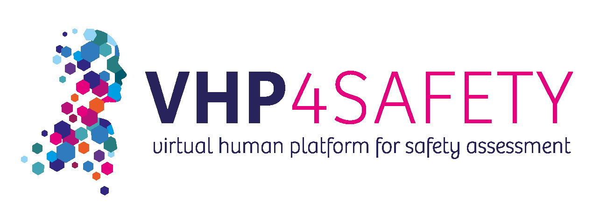

---
bioschemas:
 "@context": https://schema.org/
 "@type": LearningResource
 "http://purl.org/dc/terms/conformsTo":
  - "@type": LearningResource
  - "@id": “https://bioschemas.org/profiles/TrainingMaterial/1.0-RELEASE"
 about:
  - "@id": https://schema.org
  - "@id": http://edamontology.org/topic_2840
 audience:
  - "@type": Audience
  -  name: PhD students
 name: "Automated Access to Adverse Outcome Pathways with VHP4Safety Tools"
 author: ["Marvin Martens"]
 contributor:
  - "@type": Person
  - name: "Marvin Martens"
 description: "The AOP-Wiki serves as a comprehensive repository of Adverse Outcome Pathways (AOPs), which are essential for understanding toxicodynamic processes and informing risk assessments. This workshop is designed to help you effectively query and extract data from AOP-Wiki using various tools and interfaces which are hosted on the VHP4Safety platform."
 keywords: "AOP-Wiki"
 license: CC-BY 4.0
 version: 1.0
---

# AOP-Wiki-workshop
Go to [https://marvinm2.github.io/AOP-Wiki-workshop](https://marvinm2.github.io/AOP-Wiki-workshop).

Welcome to the Workshop on automated access to AOP-Wiki contents! This repository provides all the materials you need to explore and interact with the AOP services, including the SPARQL endpoint, SNORQL User Interface (UI), and RESTful API with Swagger UI. Whether you are new to AOP-Wiki or looking to deepen your understanding of its data querying capabilities, this workshop offers structured exercises and resources to guide you through each tool.

Explore the exercises below and select the option that best fits your learning goals.

## Workshop Overview
The AOP-Wiki serves as a comprehensive repository of Adverse Outcome Pathways (AOPs), which are essential for understanding toxicodynamic processes and informing risk assessments. This workshop is designed to help you effectively query and extract data from AOP-Wiki using various tools and interfaces which are hosted on the VHP4Safety platform. 

You will gain practical experience with:
- SPARQL Queries: Learn how to retrieve linked data from AOP-Wiki using SPARQL, the query language for RDF databases.
- SNORQL UI: Explore the user-friendly SNORQL interface for interacting with the AOP-Wiki database without needing to write complex queries.
- RESTful API: Understand how to programmatically access AOP-Wiki data using the REST API, enabling integration with other tools and automation of data retrieval.

## Option A: AOP-Wiki SPARQL
This section focuses on the fundamentals of linked data and how to use SPARQL to query the AOP-Wiki database. You will learn how to write and execute SPARQL queries to extract specific data, understand the AOP-Wiki RDF schema, and explore the relationships between different entities in the database.

[Start AOP-Wiki SPARQL Exercises](AOP-Wiki-SPARQL.md)

If you are interested in a broader introduction to SPARQL, consider exploring this general workshop: [SPARQL introduction workshop](https://bigcat-um.github.io/SPARQLTutorialBioSB2019/)

## Option B: AOP-Wiki SNORQL
This section introduces you to the SNORQL User Interface (UI), a powerful tool that simplifies interaction with the AOP-Wiki database. You will learn how to use the SNORQL UI to run and adapt pre-configured queries, explore data interactively, and understand the underlying SPARQL queries without writing code.

[Start AOP-Wiki SNORQL Exercises](AOP-Wiki-SNORQL.md)

### Key Features:
- Explore AOP-Wiki data visually.
- Run and modify queries with ease.
- Access dynamically loaded example queries tailored to specific research needs.

## Option C: AOP-Wiki RESTful API with Swagger UI
In this section, you will learn how to interact with the AOP-Wiki database programmatically using the RESTful API, using the Swagger UI. This option is ideal for users who want to integrate AOP-Wiki data into their own applications, automate data retrieval, or use tools like Python or R to process the data.

[Start AOP-Wiki API Exercises](AOP-Wiki-API.md)
